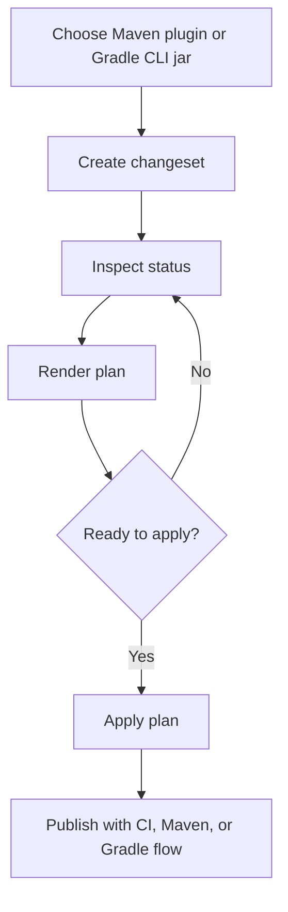

# Getting Started

## 0. Quick flow



## 1. Recommended: use the Maven plugin inside the target repository

Published coordinates:

- GroupId: `io.github.sonofmagic`
- ArtifactId: `javachanges`
- Current release: `__JAVACHANGES_LATEST_RELEASE_VERSION__`
- Maven Central page: `__JAVACHANGES_CENTRAL_OVERVIEW_URL__`
- CLI jar URL: `https://repo1.maven.org/maven2/io/github/sonofmagic/javachanges/__JAVACHANGES_LATEST_RELEASE_VERSION__/javachanges-__JAVACHANGES_LATEST_RELEASE_VERSION__.jar`

Add the plugin to the target repository `pom.xml`:

```xml
<plugin>
  <groupId>io.github.sonofmagic</groupId>
  <artifactId>javachanges</artifactId>
  <version>__JAVACHANGES_LATEST_RELEASE_VERSION__</version>
</plugin>
```

Then inside that repository, use the shortest local form:

```bash
mvn javachanges:status
mvn javachanges:plan -Djavachanges.apply=true
mvn javachanges:add -Djavachanges.summary="add release notes command" -Djavachanges.release=minor
mvn javachanges:manifest-field -Djavachanges.field=releaseVersion
```

Notes:

- this is the recommended day-to-day usage for target repositories
- the plugin defaults `--directory` to the current Maven project's `${project.basedir}`
- the generic `run` goal still exists for commands that do not have a dedicated goal yet

For the complete Maven workflow, see [Maven Usage Guide](./maven-guide.md).

## 2. Use the released CLI for Gradle

Gradle repositories should call the CLI jar directly.

Minimum Gradle shape:

```text
your-gradle-repo/
├── .changesets/
├── CHANGELOG.md
├── build.gradle.kts
├── gradle.properties
└── settings.gradle.kts
```

`gradle.properties`:

```properties
version=1.0.0-SNAPSHOT
```

`settings.gradle.kts`:

```kotlin
rootProject.name = "your-gradle-repo"
include(":core", ":api")
```

Download and run:

```bash
mvn -q dependency:copy -Dartifact=io.github.sonofmagic:javachanges:__JAVACHANGES_LATEST_RELEASE_VERSION__ -DoutputDirectory=.javachanges
java -jar .javachanges/javachanges-__JAVACHANGES_LATEST_RELEASE_VERSION__.jar status --directory .
java -jar .javachanges/javachanges-__JAVACHANGES_LATEST_RELEASE_VERSION__.jar add --directory . --summary "add release notes command" --release minor --modules core
java -jar .javachanges/javachanges-__JAVACHANGES_LATEST_RELEASE_VERSION__.jar plan --directory . --apply true
```

For the complete Gradle workflow, see [Gradle Usage Guide](./gradle-guide.md).

## 3. Alternative: use the released CLI for temporary Maven usage

Download the released jar:

```bash
mvn -q dependency:copy -Dartifact=io.github.sonofmagic:javachanges:__JAVACHANGES_LATEST_RELEASE_VERSION__ -DoutputDirectory=.javachanges
```

Run the CLI help:

```bash
java -jar .javachanges/javachanges-__JAVACHANGES_LATEST_RELEASE_VERSION__.jar --help
```

Run it against a target repository:

```bash
java -jar .javachanges/javachanges-__JAVACHANGES_LATEST_RELEASE_VERSION__.jar status --directory /path/to/repo
java -jar .javachanges/javachanges-__JAVACHANGES_LATEST_RELEASE_VERSION__.jar add --directory /path/to/repo --summary "add release notes command" --release minor
java -jar .javachanges/javachanges-__JAVACHANGES_LATEST_RELEASE_VERSION__.jar plan --directory /path/to/repo
```

Notes:

- prefer the Maven plugin for Maven repositories because it keeps commands short and auto-detects the current project directory
- use the released CLI for Gradle repositories or for temporary usage against Maven repositories where you cannot add the plugin yet

## 4. Working on the current `main` branch

```bash
mvn -q -DskipTests install
mvn io.github.sonofmagic:javachanges:__JAVACHANGES_CURRENT_SNAPSHOT_VERSION__:status
mvn io.github.sonofmagic:javachanges:__JAVACHANGES_CURRENT_SNAPSHOT_VERSION__:plan -Djavachanges.apply=true
mvn io.github.sonofmagic:javachanges:__JAVACHANGES_CURRENT_SNAPSHOT_VERSION__:add -Djavachanges.summary="add release notes command" -Djavachanges.release=minor
mvn io.github.sonofmagic:javachanges:__JAVACHANGES_CURRENT_SNAPSHOT_VERSION__:manifest-field -Djavachanges.field=releaseVersion
```

Notes:

- dedicated goals now exist for `status`, `plan`, `add`, and `manifest-field`
- `javachanges:run` is still available with `-Djavachanges.args="..."`

## 5. Prepare a target repository

Your target repository should have:

- git initialized
- a root `pom.xml` with a `<revision>` property, or a Gradle `gradle.properties` with `version` or `revision`
- a `CHANGELOG.md` file, or let `javachanges` create/update it during plan application
- either Maven `<modules>`, Gradle `include(...)` entries in `settings.gradle(.kts)`, or a single root artifact/project

## 6. Create a changeset

Monorepo example:

```bash
mvn javachanges:add -Djavachanges.summary="add release notes command" -Djavachanges.release=minor -Djavachanges.modules=core
```

Gradle CLI example:

```bash
java -jar .javachanges/javachanges-__JAVACHANGES_LATEST_RELEASE_VERSION__.jar add --directory . --summary "add release notes command" --release minor --modules core
```

Single-module example:

```bash
mvn javachanges:add -Djavachanges.summary="add release notes command" -Djavachanges.release=minor
```

This writes a markdown file into `.changesets/`.

If you want repository-level release branch conventions, also add `.changesets/config.jsonc`:

```jsonc
{
  // Default branch that receives reviewed release changesets.
  "baseBranch": "main",

  // Default branch name used by release-plan automation.
  "releaseBranch": "changeset-release/main",

  // Dedicated branch used for publishing snapshots.
  "snapshotBranch": "snapshot"
}
```

Shortest hand-written format:

```md
---
"your-artifact-id": patch
---

Fix release-notes rendering.
```

Monorepo example:

```md
---
"core": minor
"cli": patch
---

Improve CLI parsing and release planning.
```

Notes:

- `javachanges add` writes this official Changesets-style package map by default
- the first non-empty body line becomes the summary used by `status`, changelogs, and release notes
- legacy `release` / `modules` / `summary` frontmatter is still read for compatibility, but new files should use the package-map form
- changelog sections are grouped by the aggregated release level: `major`, `minor`, `patch`

## 7. Inspect the plan

```bash
mvn javachanges:plan
```

Gradle CLI:

```bash
java -jar .javachanges/javachanges-__JAVACHANGES_LATEST_RELEASE_VERSION__.jar plan --directory .
```

## 8. Apply the plan

```bash
mvn javachanges:plan -Djavachanges.apply=true
```

Gradle CLI:

```bash
java -jar .javachanges/javachanges-__JAVACHANGES_LATEST_RELEASE_VERSION__.jar plan --directory . --apply true
```

That updates:

- the root Maven `revision` or Gradle `gradle.properties` version
- `CHANGELOG.md`
- `.changesets/release-plan.json`
- `.changesets/release-plan.md`

## 9. Running from source during development

If you are working on the `javachanges` repository itself, use the source-driven development flow instead:

```bash
mvn -q test
mvn -q -DskipTests compile exec:java -Dexec.args="status --directory /path/to/your/repo"
```

For the full development workflow, see [Development Guide](./development-guide.md).
