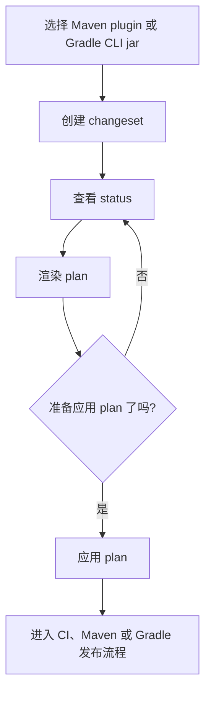

# 快速开始

## 0. 快速流程图



## 1. 推荐用法：在目标仓库里直接用 Maven plugin

当前已发布坐标：

- GroupId：`io.github.sonofmagic`
- ArtifactId：`javachanges`
- 当前正式版本：`__JAVACHANGES_LATEST_RELEASE_VERSION__`
- Maven Central 页面：`__JAVACHANGES_CENTRAL_OVERVIEW_URL__`
- CLI jar 地址：`https://repo1.maven.org/maven2/io/github/sonofmagic/javachanges/__JAVACHANGES_LATEST_RELEASE_VERSION__/javachanges-__JAVACHANGES_LATEST_RELEASE_VERSION__.jar`

先在目标仓库的 `pom.xml` 里声明 plugin：

```xml
<plugin>
  <groupId>io.github.sonofmagic</groupId>
  <artifactId>javachanges</artifactId>
  <version>__JAVACHANGES_LATEST_RELEASE_VERSION__</version>
</plugin>
```

然后直接在该仓库里执行最短写法：

```bash
mvn javachanges:status
mvn javachanges:plan -Djavachanges.apply=true
mvn javachanges:add -Djavachanges.summary="add release notes command" -Djavachanges.release=minor
mvn javachanges:manifest-field -Djavachanges.field=releaseVersion -Djavachanges.fresh=true
```

说明：

- 这是目标仓库里最推荐的日常用法
- plugin 会默认把 `--directory` 设成当前 Maven 项目的 `${project.basedir}`
- 对还没有独立 goal 的命令，仍然可以继续使用通用的 `run` goal

完整 Maven 流程见 [Maven 使用指南](./maven-guide.md)。

## 2. Gradle 仓库使用正式发布版 CLI

Gradle 仓库应直接调用 CLI jar。

最小 Gradle 结构：

```text
your-gradle-repo/
├── .changesets/
├── CHANGELOG.md
├── build.gradle.kts
├── gradle.properties
└── settings.gradle.kts
```

`gradle.properties`：

```properties
version=1.0.0-SNAPSHOT
```

`settings.gradle.kts`：

```kotlin
rootProject.name = "your-gradle-repo"
include(":core", ":api")
```

下载并执行：

```bash
mvn -q dependency:copy -Dartifact=io.github.sonofmagic:javachanges:__JAVACHANGES_LATEST_RELEASE_VERSION__ -DoutputDirectory=.javachanges
java -jar .javachanges/javachanges-__JAVACHANGES_LATEST_RELEASE_VERSION__.jar status --directory .
java -jar .javachanges/javachanges-__JAVACHANGES_LATEST_RELEASE_VERSION__.jar add --directory . --summary "add release notes command" --release minor --modules core
java -jar .javachanges/javachanges-__JAVACHANGES_LATEST_RELEASE_VERSION__.jar plan --directory . --apply true
```

完整 Gradle 流程见 [Gradle 使用指南](./gradle-guide.md)。

## 3. 备选用法：临时 Maven 场景使用正式发布版 CLI

先把正式发布的 jar 下载到本地：

```bash
mvn -q dependency:copy -Dartifact=io.github.sonofmagic:javachanges:__JAVACHANGES_LATEST_RELEASE_VERSION__ -DoutputDirectory=.javachanges
```

然后查看 CLI 帮助：

```bash
java -jar .javachanges/javachanges-__JAVACHANGES_LATEST_RELEASE_VERSION__.jar --help
```

对目标仓库执行：

```bash
java -jar .javachanges/javachanges-__JAVACHANGES_LATEST_RELEASE_VERSION__.jar status --directory /path/to/repo
java -jar .javachanges/javachanges-__JAVACHANGES_LATEST_RELEASE_VERSION__.jar add --directory /path/to/repo --summary "add release notes command" --release minor
java -jar .javachanges/javachanges-__JAVACHANGES_LATEST_RELEASE_VERSION__.jar plan --directory /path/to/repo
```

说明：

- 日常对仓库执行命令时，优先使用 Maven plugin，命令更短，也不需要手动传当前项目目录
- 正式版 CLI 更适合临时接管一个你还没来得及接入 plugin 的仓库

## 4. 开发当前 `main` 分支时的 plugin 用法

```bash
mvn -q -DskipTests install
mvn io.github.sonofmagic:javachanges:__JAVACHANGES_CURRENT_SNAPSHOT_VERSION__:status
mvn io.github.sonofmagic:javachanges:__JAVACHANGES_CURRENT_SNAPSHOT_VERSION__:plan -Djavachanges.apply=true
mvn io.github.sonofmagic:javachanges:__JAVACHANGES_CURRENT_SNAPSHOT_VERSION__:add -Djavachanges.summary="add release notes command" -Djavachanges.release=minor
mvn io.github.sonofmagic:javachanges:__JAVACHANGES_CURRENT_SNAPSHOT_VERSION__:manifest-field -Djavachanges.field=releaseVersion
```

说明：

- 现在 `status`、`plan`、`add`、`manifest-field` 都有独立 goal
- `javachanges:run` 仍然保留，适合配合 `-Djavachanges.args="..."` 传递完整原始参数

## 5. 准备目标仓库

你的目标仓库至少需要满足：

- 已初始化 git
- 有带 `<revision>` 属性的根 `pom.xml`，或有带 `version` / `revision` 的 Gradle `gradle.properties`
- 有 `CHANGELOG.md`，或者让 `javachanges` 在应用 release plan 时自动创建/更新
- Maven 根 `pom.xml` 中有 `<modules>`、Gradle `settings.gradle(.kts)` 中有 `include(...)`，或是单模块根 artifact / project

## 6. 创建 changeset

Monorepo 示例：

```bash
mvn javachanges:add -Djavachanges.summary="add release notes command" -Djavachanges.release=minor -Djavachanges.modules=core
```

Gradle CLI 示例：

```bash
java -jar .javachanges/javachanges-__JAVACHANGES_LATEST_RELEASE_VERSION__.jar add --directory . --summary "add release notes command" --release minor --modules core
```

单模块示例：

```bash
mvn javachanges:add -Djavachanges.summary="add release notes command" -Djavachanges.release=minor
```

这个命令会往 `.changesets/` 写入一个 Markdown 文件。

如果你还想约定仓库级的发布分支规则，也可以同时加上 `.changesets/config.jsonc`：

```jsonc
{
  // 用于承接正式 release plan 的默认基线分支。
  "baseBranch": "main",

  // release-plan 自动化默认生成的分支名。
  "releaseBranch": "changeset-release/main",

  // 用于发布 snapshot 的专用分支。
  "snapshotBranch": "snapshot"
}
```

最短手写格式：

```md
---
"your-artifact-id": patch
---

Fix release-notes rendering.
```

Monorepo 示例：

```md
---
"core": minor
"cli": patch
---

Improve CLI parsing and release planning.
```

说明：

- `javachanges add` 默认会生成这种官方 Changesets 风格的 package map
- 正文第一条非空行会作为 `status`、changelog 和 release notes 使用的 summary
- 旧的 `release` / `modules` / `summary` frontmatter 仍然可兼容读取，但新文件建议统一写 package map
- changelog 会按聚合后的 release level 分成 `major`、`minor`、`patch`

## 7. 查看计划

```bash
mvn javachanges:plan
```

Gradle CLI：

```bash
java -jar .javachanges/javachanges-__JAVACHANGES_LATEST_RELEASE_VERSION__.jar plan --directory .
```

## 8. 应用计划

```bash
mvn javachanges:plan -Djavachanges.apply=true
```

Gradle CLI：

```bash
java -jar .javachanges/javachanges-__JAVACHANGES_LATEST_RELEASE_VERSION__.jar plan --directory . --apply true
```

应用后会更新：

- 根 Maven `revision` 或 Gradle `gradle.properties` 版本
- `CHANGELOG.md`
- `.changesets/release-plan.json`
- `.changesets/release-plan.md`

## 9. 以源码方式进入开发模式

如果你是在开发 `javachanges` 这个仓库本身，才使用源码驱动的开发方式：

```bash
mvn -q test
mvn -q -DskipTests compile exec:java -Dexec.args="status --directory /path/to/your/repo"
```

完整开发流程请看 [Development Guide](./development-guide.md)。
