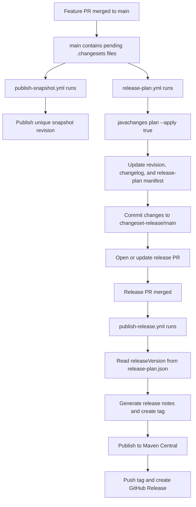

# javachanges GitHub Actions Release Flow


## 1. Overview

This repository now includes a GitHub Actions release pipeline built on `javachanges` itself.

This page is repository-specific. For broader GitHub Actions integration patterns, see [GitHub Actions Usage Guide](./github-actions-guide.md).

The intended flow is:

1. feature branches merge into `main`
2. `main` contains one or more `.changesets/*.md` files
3. GitHub Actions generates or updates a release PR
4. the release PR is merged
5. GitHub Actions can publish snapshots from `snapshot`
6. GitHub Actions tags the release, publishes to Maven Central, and creates a GitHub Release

## 1.1 Workflow graph



## 2. Workflows

The repository contains four workflows:

| File | Purpose |
| --- | --- |
| `.github/workflows/ci.yml` | Regular CI for Java 8 build and publish-profile verification |
| `.github/workflows/release-plan.yml` | Scans pending changesets on `main` and generates a release PR |
| `.github/workflows/publish-snapshot.yml` | Publishes the current `snapshot` branch build to the configured snapshot repository |
| `.github/workflows/publish-release.yml` | Publishes after the release PR is merged |

## 3. Release PR workflow

The core command in `release-plan.yml` is:

```bash
mvn -B -DskipTests compile exec:java -Dexec.args="plan --directory $GITHUB_WORKSPACE --apply true"
```

It:

| Action | Meaning |
| --- | --- |
| Reads `.changesets/*.md` | Collects pending release intent |
| Computes release versions | Produces `releaseVersion` and `nextSnapshotVersion` |
| Applies the plan | Updates `<revision>`, `CHANGELOG.md`, and `.changesets/release-plan.json` |
| Deletes consumed changesets | Prevents duplicate releases |

The workflow then commits those changes to:

```bash
changeset-release/main
```

and creates or updates a pull request.

## 4. Snapshot publish workflow

`publish-snapshot.yml` runs on pushes to `snapshot` and on manual `workflow_dispatch`.

It:

1. validates snapshot repository variables and credentials
2. derives a stable snapshot build stamp for the workflow run
3. runs `javachanges preflight --snapshot`
4. runs `javachanges publish --snapshot --execute true`

The workflow publishes a unique snapshot revision such as:

```text
1.3.1-20260420.154500.abc1234-SNAPSHOT
```

In this repository, the workflow explicitly passes a build stamp based on:

```text
<github.run_id>.<github.run_attempt>.<git short sha>
```

so reruns remain distinguishable even when they target the same root snapshot line on the `snapshot` branch.

Configure these GitHub Actions secrets for snapshot publishing:

| Type | Name | Required |
| --- | --- | --- |
| Secret | `MAVEN_CENTRAL_USERNAME` | Yes |
| Secret | `MAVEN_CENTRAL_PASSWORD` | Yes |
| Secret | `MAVEN_GPG_PRIVATE_KEY` | Yes |
| Secret | `MAVEN_GPG_PASSPHRASE` | Yes |

The snapshot workflow in this repository now uses `central-publishing-maven-plugin` with a `-SNAPSHOT` revision and the same Central Portal token pair used for releases, instead of publishing through `distributionManagement` with a separate `maven-snapshots` server id.

## 5. Release publish workflow

`publish-release.yml` only runs when all of these are true:

| Condition | Meaning |
| --- | --- |
| the PR was merged | not just closed |
| the base branch is `main` | only the mainline is released |
| the head branch is `changeset-release/main` | only release PRs trigger publishing |

It then:

1. checks out the merged release commit
2. reads `releaseVersion` from `.changesets/release-plan.json`
3. creates a local tag `vX.Y.Z`
4. generates `target/release-notes.md`
5. publishes to Maven Central with the `central-publish` profile
6. pushes the git tag
7. creates a GitHub Release

## 6. Required repository secrets

Configure these in `Settings > Secrets and variables > Actions`:

| Secret | Purpose |
| --- | --- |
| `MAVEN_CENTRAL_USERNAME` | Sonatype Central Portal token username |
| `MAVEN_CENTRAL_PASSWORD` | Sonatype Central Portal token password |
| `MAVEN_GPG_PRIVATE_KEY` | ASCII-armored GPG private key |
| `MAVEN_GPG_PASSPHRASE` | GPG private key passphrase |

`publish-release.yml` validates these secrets before it prepares Java, Maven settings, or GPG. If any secret is missing, the workflow stops immediately with a direct error that names the missing secret.

For the failed run at `Actions > Publish Release`, the practical recovery path is:

1. add the missing secrets
2. rerun the failed workflow or failed job
3. confirm the rerun reaches the `Publish to Maven Central` step

## 7. Recommended usage

Typical development flow:

1. create a branch
2. change code
3. add a changeset
4. open a PR
5. merge into `main`

Example:

```bash
mvn -q -DskipTests compile exec:java -Dexec.args="add --directory $PWD --summary 'add GitHub Actions release automation' --release minor"
```

That command writes a changeset file in the official package-map format, for example:

````md
```md
---
"javachanges": minor
---

add GitHub Actions release automation
```
````

## 8. Versioning model

To support “merge release PR first, publish the real release afterwards,” this repository now uses:

```xml
<version>${revision}</version>
```

and maintains development state with:

```xml
<revision>1.0.0-SNAPSHOT</revision>
```

That means:

| Stage | Version |
| --- | --- |
| Published version | Read from `.changesets/release-plan.json`, for example `1.0.0` |
| Main branch version | Already advanced to the next snapshot, for example `1.0.1-SNAPSHOT` |

The publish workflow uses:

```bash
-Drevision=<releaseVersion>
```

so it publishes the real release version instead of the current snapshot revision on `main`.

The snapshot workflow uses:

```bash
-Drevision=<baseVersion>-<snapshotBuildStamp>-SNAPSHOT
```

so repeated snapshot publishes do not overwrite one another under the same visible revision line.

In this repository, the intended developer path is:

1. merge release work into `main`
2. merge work that should produce a published snapshot into `snapshot`
3. let `publish-snapshot.yml` publish from the `snapshot` branch head

## 9. Manual triggers

If you need to rerun one of the workflows manually:

| Workflow | Supports `workflow_dispatch` |
| --- | --- |
| `Release Plan` | Yes |
| `Publish Snapshot` | Yes |
| `Publish Release` | No, it only runs on merged release PRs |

If a merged release PR already triggered a failed `Publish Release` run, you usually do not need a new release PR. After fixing repository secrets, rerun the existing failed run from the Actions page.

## 10. Local validation

Before relying on the automation, you can validate locally:

```bash
mvn -B verify
mvn -B -Pcentral-publish -Dgpg.skip=true verify
mvn -B -DskipTests compile exec:java -Dexec.args="status --directory $PWD"
mvn -B -DskipTests compile exec:java -Dexec.args="preflight --directory $PWD --snapshot --snapshot-build-stamp local.dev.001"
```

## 11. Summary

The standard release path for this repository is now:

| Stage | Entry point |
| --- | --- |
| Regular validation | `CI` workflow |
| Snapshot publishing | `Publish Snapshot` workflow |
| Release PR generation | `Release Plan` workflow |
| Real publishing | `Publish Release` workflow |

For reusable workflow patterns outside this repository, continue with [GitHub Actions Usage Guide](./github-actions-guide.md).
