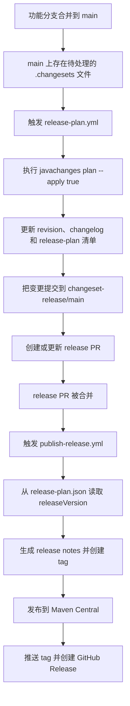

# javachanges GitHub Actions 发布流程使用指南


## 1. 概述

这个仓库现在已经接入了一套基于 `javachanges` 自身命令的 GitHub Actions 发布流程。

这份文档是当前仓库自举发布流程的专用说明。如果你想看更通用的 GitHub Actions 接入方式，请继续看 [GitHub Actions Usage Guide](./github-actions-guide.md)。

目标流程如下：

1. 功能分支合并到 `main`
2. `main` 上如果存在 `.changesets/*.md`
3. GitHub Actions 自动生成或更新 release PR
4. release PR 合并后
5. GitHub Actions 自动打 tag、发布到 Maven Central、创建 GitHub Release

## 1.1 工作流流程图



## 2. 工作流组成

仓库包含三条工作流：

| 文件 | 作用 |
| --- | --- |
| `.github/workflows/ci.yml` | 常规 CI，验证 Java 8 构建和发布 profile |
| `.github/workflows/release-plan.yml` | 在 `main` 上扫描 changesets，自动生成 release PR |
| `.github/workflows/publish-release.yml` | 在 release PR 合并后执行正式发布 |

## 3. release PR 工作流

`release-plan.yml` 的核心逻辑是：

```bash
mvn -B -DskipTests compile exec:java -Dexec.args="plan --directory $GITHUB_WORKSPACE --apply true"
```

它会：

| 动作 | 说明 |
| --- | --- |
| 读取 `.changesets/*.md` | 收集待发布变更 |
| 计算发布版本 | 生成 `releaseVersion` 和 `nextSnapshotVersion` |
| 应用发布计划 | 更新 `<revision>`、`CHANGELOG.md`、`.changesets/release-plan.json` |
| 删除已消费的 changeset | 避免重复发布 |

工作流随后会把这些变更提交到：

```bash
changeset-release/main
```

并自动创建或更新 PR。

## 4. publish 工作流

`publish-release.yml` 只在以下条件满足时触发：

| 条件 | 说明 |
| --- | --- |
| PR 已 merged | 必须是真的合并，不是关闭 |
| base branch 是 `main` | 只发布主线 |
| head branch 是 `changeset-release/main` | 只处理 release PR |

它会依次做这些事：

1. checkout release PR 的 merge commit
2. 读取 `.changesets/release-plan.json` 中的 `releaseVersion`
3. 创建本地 tag `vX.Y.Z`
4. 生成 `target/release-notes.md`
5. 用 `central-publish` profile 发布到 Maven Central
6. 推送 git tag
7. 创建 GitHub Release

## 5. 仓库必须配置的 Secrets

你需要在 GitHub 仓库的 `Settings > Secrets and variables > Actions` 中配置：

| Secret | 用途 |
| --- | --- |
| `MAVEN_CENTRAL_USERNAME` | Sonatype Central Portal token username |
| `MAVEN_CENTRAL_PASSWORD` | Sonatype Central Portal token password |
| `MAVEN_GPG_PRIVATE_KEY` | ASCII armored GPG 私钥 |
| `MAVEN_GPG_PASSPHRASE` | GPG 私钥口令 |

`publish-release.yml` 现在会在准备 Java、Maven settings 和 GPG 之前先校验这些 secrets。只要有任意一个缺失，工作流会立刻失败，并直接指出缺的是哪一个 secret。

针对这次已经失败的 `Publish Release` 运行，实际恢复步骤就是：

1. 把缺少的 secrets 补齐
2. 在 Actions 页面重跑失败的 workflow 或 job
3. 确认重跑后能进入 `Publish to Maven Central` 这一步

## 6. 推荐使用方式

日常开发时：

1. 新建分支
2. 修改代码
3. 添加 changeset
4. 提交并发起 PR
5. 合并到 `main`

添加 changeset 的示例：

```bash
mvn -q -DskipTests compile exec:java -Dexec.args="add --directory $PWD --summary 'add GitHub Actions release automation' --release minor"
```

这条命令现在会写出官方 package-map 风格的 changeset 文件，例如：

````md
```md
---
"javachanges": minor
---

add GitHub Actions release automation
```
````

## 7. 版本模式说明

为了支持 release PR 合并后再发布正式版，当前仓库已经切换到：

```xml
<version>${revision}</version>
```

并通过：

```xml
<revision>1.0.0-SNAPSHOT</revision>
```

维护开发版本。

这样 release PR 合并后：

| 阶段 | 版本 |
| --- | --- |
| 发布版本 | 从 `.changesets/release-plan.json` 读取，例如 `1.0.0` |
| 主干版本 | 已提前推进到下一个快照，例如 `1.0.1-SNAPSHOT` |

publish workflow 会在真正部署时使用：

```bash
-Drevision=<releaseVersion>
```

从而发布正式版，而不会把快照版上传到 Central。

## 8. 手动触发

如果你需要手动重跑 release PR 生成流程，可以在 GitHub Actions 页面手动触发：

| 工作流 | 是否支持 `workflow_dispatch` |
| --- | --- |
| `Release Plan` | 是 |
| `Publish Release` | 否，默认只在 release PR merge 时触发 |

如果某个已经 merge 的 release PR 触发过失败的 `Publish Release`，通常不需要重新再走一遍 release PR。把仓库 secrets 修好以后，直接在 Actions 页面重跑那次失败运行即可。

## 9. 发布前本地验证

在本地，你可以先验证这个自举流程是否正常：

```bash
mvn -B verify
mvn -B -Pcentral-publish -Dgpg.skip=true verify
mvn -B -DskipTests compile exec:java -Dexec.args="status --directory $PWD"
```

## 10. 总结

现在这个仓库的标准发布路径是：

| 阶段 | 入口 |
| --- | --- |
| 日常校验 | `CI` workflow |
| 生成 release PR | `Release Plan` workflow |
| 正式发布 | `Publish Release` workflow |

如果你需要可复用到其它仓库的 GitHub Actions 模板和命令拆分，请继续看 [GitHub Actions Usage Guide](./github-actions-guide.md)。
