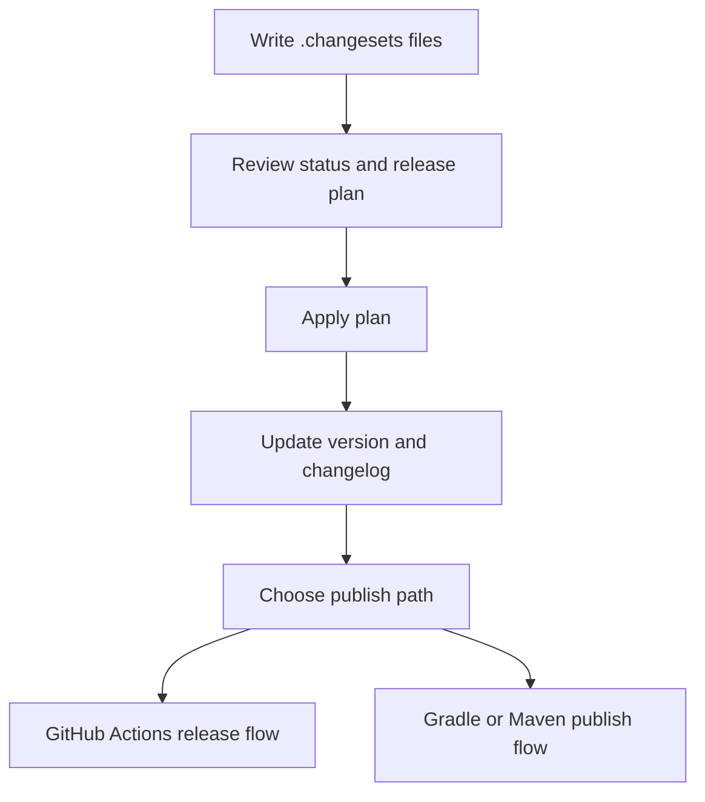

# javachanges

`javachanges` is a release-planning CLI for Maven and Gradle repositories.

The workflow is intentionally simple:

1. contributors record intended changes in `.changesets/*.md`
2. CI or maintainers inspect a generated release plan
3. the plan updates the root version and changelog
4. CI publishes with Maven deploy or Gradle-native publishing tasks

The tool stays file-centric. It does not require a database or a hosted service.

## Release flow at a glance

## Core ideas

- Keep release intent in versioned files.
- Review release plans before publishing.
- Generate changelogs from structured Changesets-compatible metadata.
- Avoid shell-heavy release logic where possible.

## What the CLI assumes

- a Maven repository with a root `pom.xml`, or a Gradle repository with `gradle.properties`
- Maven `<modules>`, Gradle `include(...)` entries, or a single root artifact/project
- a root Maven `revision` or Gradle `version` property used for versioning
- a `.changesets/` directory to store release notes-in-progress

## Guides

- [LLM Access](./llms-access.md)
- [Getting Started](./getting-started.md)
- [Maven Usage Guide](./maven-guide.md)
- [Gradle Usage Guide](./gradle-guide.md)
- [Examples Guide](./examples-guide.md)
- [Command Cookbook](./command-cookbook.md)
- [Configuration Reference](./configuration-reference.md)
- [CLI Reference](./cli-reference.md)
- [Development Guide](./development-guide.md)
- [Release Plan Manifest](./release-plan-manifest.md)
- [Output Contracts](./output-contracts.md)
- [Troubleshooting Guide](./troubleshooting-guide.md)
- [Cloudflare Workers Builds](./cloudflare-workers-builds.md)
- [GitHub Actions Release Flow](./github-actions-release.md)
- [GitHub Actions Usage Guide](./github-actions-guide.md)
- [GitLab CI/CD Usage Guide](./gitlab-ci-guide.md)
- [Publish To Maven Central](./publish-to-maven-central.md)
- [Use Cases](./use-cases.md)
