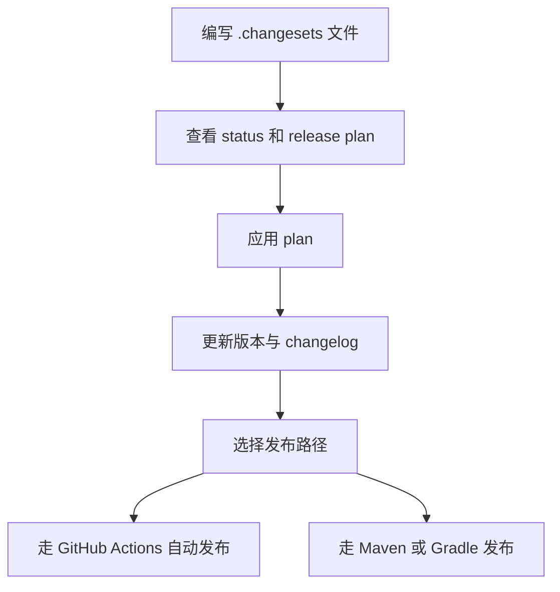

# javachanges

`javachanges` 是一个面向 Maven 和 Gradle 仓库的发布规划 CLI。

整个工作流保持简单：

1. 开发者在 `.changesets/*.md` 中记录准备发布的变更
2. CI 或维护者查看生成的 release plan
3. release plan 更新根版本和 changelog
4. CI 使用 Maven deploy 或 Gradle 原生 publishing task 发布

这个工具保持文件驱动，不依赖数据库或托管服务。

## 一眼看懂发布流程

## 核心理念

- 把发布意图保存在可版本控制的文件里
- 在真正发布前先审阅 release plan
- 从兼容 Changesets 的结构化元数据生成 changelog
- 尽量减少脆弱、难维护的 shell 发布脚本

## CLI 假设

- 一个带根 `pom.xml` 的 Maven 仓库，或一个带 `gradle.properties` 的 Gradle 仓库
- Maven `<modules>`、Gradle `include(...)`，或单模块根 artifact / project
- 用于版本管理的根 Maven `revision` 或 Gradle `version`
- 用来存放进行中发布记录的 `.changesets/` 目录

## 指南

- [AI 文档入口](./llms-access.md)
- [Getting Started](./getting-started.md)
- [Maven 使用指南](./maven-guide.md)
- [Gradle 使用指南](./gradle-guide.md)
- [Examples Guide 使用指南](./examples-guide.md)
- [命令实战手册](./command-cookbook.md)
- [配置参考大全](./configuration-reference.md)
- [CLI 命令参考](./cli-reference.md)
- [Development Guide](./development-guide.md)
- [Release Plan Manifest 说明](./release-plan-manifest.md)
- [输出契约说明](./output-contracts.md)
- [故障排查指南](./troubleshooting-guide.md)
- [Cloudflare Workers Builds 配置指南](./cloudflare-workers-builds.md)
- [GitHub Actions Release Flow](./github-actions-release.md)
- [GitHub Actions Usage Guide](./github-actions-guide.md)
- [GitLab CI/CD Usage Guide](./gitlab-ci-guide.md)
- [Publish To Maven Central](./publish-to-maven-central.md)
- [Use Cases](./use-cases.md)
