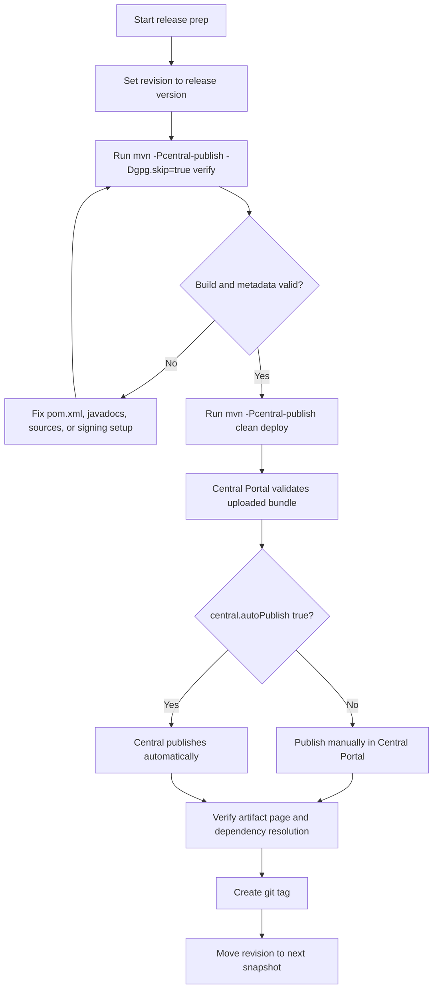

# javachanges Publish To Maven Central Guide


## 1. Overview

This repository now includes the core Maven configuration required for Maven Central publishing:

| Capability | Meaning |
| --- | --- |
| `sources.jar` | Attached through `maven-source-plugin` |
| `javadoc.jar` | Attached through `maven-javadoc-plugin` |
| GPG signatures | Added by `maven-gpg-plugin` during `verify` |
| Central upload | Handled by `central-publishing-maven-plugin` during `deploy` |
| Executable CLI jar | `Main-Class` written by `maven-jar-plugin` |

The publishing flow is isolated behind the Maven profile:

```bash
-Pcentral-publish
```

That keeps everyday local builds separate from real Central publishing.

## 1.1 Publishing flow



## 2. Prerequisites

Before a real Maven Central release, make sure all of these are ready:

| Item | Required state |
| --- | --- |
| Namespace | Verified in Sonatype Central Portal |
| Portal token | Generated and stored locally or in CI secrets |
| GPG key | Created and available on the publishing machine |
| Version | Must not end with `-SNAPSHOT` |
| Git tag | Recommended for the release version |

> Note: never commit Portal tokens, GPG private keys, or passphrases into the repository.

## 3. Configure `settings.xml`

### 3.1 Default server id

The default Central server id in this repository is:

```xml
<id>central</id>
```

That maps to the `pom.xml` property:

```xml
<central.publishing.serverId>central</central.publishing.serverId>
```

### 3.2 Recommended config

Store your Sonatype Central Portal token in `~/.m2/settings.xml`:

```xml
<settings>
  <servers>
    <server>
      <id>central</id>
      <username>your portal token username</username>
      <password>your portal token password</password>
    </server>
  </servers>
</settings>
```

If you prefer another server id, override it during publish:

```bash
mvn -Pcentral-publish -Dcentral.publishing.serverId=your-server-id deploy
```

The `<id>` inside `settings.xml` must match.

## 4. Configure GPG

### 4.1 Generate a key

```bash
gpg --full-generate-key
```

### 4.2 Inspect keys

```bash
gpg --list-secret-keys --keyid-format LONG
```

### 4.3 Warm up `gpg-agent`

```bash
echo "test" | gpg --clearsign
```

> Tip: prompts or keychain dialogs during signing are expected. Maven Central requires `.asc` signatures for published files.

## 5. Switch to a release version

If the repository currently has:

```xml
<revision>1.0.0-SNAPSHOT</revision>
```

change it to a real release version first:

```xml
<revision>1.0.0</revision>
```

After the release, move it forward again, for example:

```xml
<revision>1.0.1-SNAPSHOT</revision>
```

## 6. Enrich the Sonatype Central artifact page

The Sonatype Central artifact page is not a customizable project website.

It mostly renders a fixed layout from standard POM metadata. That means:

1. what the page can show depends on which standard fields are present in `pom.xml`
2. already-published versions do not refresh just because you changed `main`
3. richer metadata only shows up after the next real release that contains it

This repository now includes the main metadata fields that help Central show a fuller artifact page:

| POM field | Purpose |
| --- | --- |
| `<name>` | artifact display name |
| `<description>` | short artifact summary |
| `<url>` | project homepage |
| `<licenses>` | license details |
| `<developers>` | developer details |
| `<organization>` | organization details |
| `<issueManagement>` | issue tracker link |
| `<ciManagement>` | CI link |
| `<scm>` | source control details |
| `<inceptionYear>` | project start year |

A representative metadata block looks like this:

```xml
<organization>
  <name>sonofmagic</name>
  <url>https://github.com/sonofmagic</url>
</organization>

<issueManagement>
  <system>GitHub Issues</system>
  <url>https://github.com/sonofmagic/javachanges/issues</url>
</issueManagement>

<ciManagement>
  <system>GitHub Actions</system>
  <url>https://github.com/sonofmagic/javachanges/actions</url>
</ciManagement>
```

> Note: Central uses a fixed template. You cannot add a custom logo section, README rendering, screenshots, arbitrary badges, or custom landing-page blocks there.

If your goal is a fuller Central page, check these fields before release:

| Check | Recommendation |
| --- | --- |
| `description` | explain the package in one sentence |
| `url` | point to the repo or project home |
| `developers` | include at least `name` and `url` |
| `organization` | add it when available |
| `issueManagement` | link to Issues |
| `ciManagement` | link to Actions or your CI |
| `scm` | keep `connection`, `developerConnection`, and `url` complete |

## 7. Local preflight

Before `deploy`, validate the publishing build:

```bash
mvn -Pcentral-publish -Dgpg.skip=true verify
```

This checks:

| Check | Meaning |
| --- | --- |
| Main jar | Packaging works |
| `sources.jar` | Sources are attached |
| `javadoc.jar` | Javadocs are attached |
| Publish profile | Publishing configuration is wired correctly |

`-Dgpg.skip=true` is only for validating the build chain before real signing.

## 8. First manual release

### 8.1 Recommended first step

For the first release, it is safer to upload and validate first instead of immediately auto-publishing.

The current defaults in `pom.xml` are:

| Parameter | Default |
| --- | --- |
| `central.autoPublish` | `false` |
| `central.waitUntil` | `validated` |

So the normal behavior is:

1. upload the bundle to Central Portal
2. wait for validation
3. publish manually in the portal once validation passes

### 8.2 Publish command

```bash
mvn -Pcentral-publish clean deploy
```

If your GPG key requires a passphrase, Maven will ask for it.

## 9. Auto-publish

Once the first manual release has proven stable, you can auto-publish:

```bash
mvn -Pcentral-publish \
  -Dcentral.autoPublish=true \
  -Dcentral.waitUntil=published \
  clean deploy
```

That uploads, validates, publishes, and waits until the deployment reaches `published`.

## 9.1 Snapshot publishing with the Central plugin

Sonatype Central also supports publishing `-SNAPSHOT` versions through `central-publishing-maven-plugin`.

In this repository, that path is isolated behind:

```bash
-Pcentral-snapshot-publish
```

The profile keeps the same source, javadoc, flatten, and GPG packaging chain, but uses the Central plugin with the Central Portal token server id instead of a separate `maven-snapshots` Maven server id.

Recommended local snapshot command:

```bash
pnpm snapshot:publish:local
```

That script:

1. resolves the current project snapshot version
2. appends a unique UTC timestamp plus `git rev-parse --short HEAD`
3. publishes the resulting revision through `central-publishing-maven-plugin`

If you want to override the generated build stamp, set `JAVACHANGES_SNAPSHOT_BUILD_STAMP` before running the command.

## 10. Recommended release sequence

1. make sure the worktree is clean: `git status`
2. change `revision` to the real release version, for example `1.0.0`
3. run `mvn -Pcentral-publish -Dgpg.skip=true verify`
4. confirm GPG works, then run `mvn -Pcentral-publish clean deploy`
5. inspect the deployment in Sonatype Central Portal
6. if you are still using manual publish mode, click publish in the portal
7. create a git tag such as `v1.0.0`
8. move the version to the next snapshot, such as `1.0.1-SNAPSHOT`

## 11. Verify the result

After publishing, check:

| Type | Location |
| --- | --- |
| Central Portal | `https://central.sonatype.com` |
| Maven Central artifact page | `https://central.sonatype.com/artifact/io.github.sonofmagic/javachanges` |

You can also verify dependency resolution in a small sample project:

```xml
<dependency>
  <groupId>io.github.sonofmagic</groupId>
  <artifactId>javachanges</artifactId>
  <version>__JAVACHANGES_LATEST_RELEASE_VERSION__</version>
</dependency>
```

And since this project also ships a Maven plugin, the shortest smoke test is usually:

```bash
mvn javachanges:status
```

If you specifically want to verify the executable CLI artifact, you can still test:

```bash
java -jar javachanges-__JAVACHANGES_LATEST_RELEASE_VERSION__.jar
```

## 12. FAQ

### 12.1 Missing `sources.jar` or `javadoc.jar`

Cause: the `central-publish` profile was not enabled, or the packaging chain is broken.

Fix:

```bash
mvn -Pcentral-publish -Dgpg.skip=true verify
```

### 12.2 Missing signatures

Cause: GPG is not configured correctly, or `gpg-agent` has not cached the passphrase.

Fix:

1. run `gpg --list-secret-keys --keyid-format LONG`
2. run `echo "test" | gpg --clearsign`
3. rerun the Maven publish command

### 12.3 Authentication failures

Cause: the token in `settings.xml` is wrong, or the server id does not match.

Fix:

1. inspect the `<id>` in `~/.m2/settings.xml`
2. inspect `central.publishing.serverId` in `pom.xml`
3. confirm the token has not expired or been revoked

### 12.4 Why the Central page did not change immediately after I edited `pom.xml`

Cause: Central shows the metadata snapshot embedded in a published version, not the current state of your repository.

Fix:

1. update the metadata in `pom.xml`
2. publish a new version
3. inspect the new version page in Central

## 13. Summary

The publishing commands for this repository reduce to:

| Goal | Command |
| --- | --- |
| Pre-publish verification | `mvn -Pcentral-publish -Dgpg.skip=true verify` |
| Real publish | `mvn -Pcentral-publish clean deploy` |

## 13. References

| Resource | Link |
| --- | --- |
| Sonatype Central Portal Maven publishing | https://central.sonatype.org/publish/publish-portal-maven/ |
| Sonatype publishing requirements | https://central.sonatype.org/publish/requirements/ |
| Sonatype GPG requirements | https://central.sonatype.org/publish/requirements/gpg/ |
| Maven Source Plugin | https://maven.apache.org/plugins/maven-source-plugin/ |
| Maven Javadoc Plugin | https://maven.apache.org/plugins/maven-javadoc-plugin/ |
| Maven GPG Plugin | https://maven.apache.org/plugins/maven-gpg-plugin/ |
