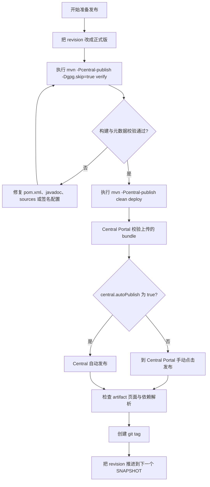

# javachanges 发布到 Maven Central 使用指南


## 1. 概述

这个仓库已经补齐了 Maven Central 发布所需的核心 Maven 配置：

| 能力 | 说明 |
| --- | --- |
| `sources.jar` | 通过 `maven-source-plugin` 附加 |
| `javadoc.jar` | 通过 `maven-javadoc-plugin` 附加 |
| GPG 签名 | 通过 `maven-gpg-plugin` 在 `verify` 阶段签名 |
| Central 上传 | 通过 `central-publishing-maven-plugin` 在 `deploy` 阶段上传 |
| CLI 可执行 JAR | 通过 `maven-jar-plugin` 写入 `Main-Class` |

当前发布流程使用专门的 Maven profile：

```bash
-Pcentral-publish
```

这样做的目的是把“普通本地开发构建”和“正式发布到 Central”隔离开，避免你平时执行 `mvn deploy` 时误触发 Central 发布。

## 1.1 发布流程图



## 2. 发布前提

正式发布到 Maven Central 前，你需要确认以下前置条件都已完成：

| 项目 | 状态要求 |
| --- | --- |
| Namespace | 已在 Sonatype Central Portal 验证通过 |
| Portal Token | 已生成并保存在本地 |
| GPG 密钥 | 已生成，并且当前机器可用于签名 |
| 版本号 | 不能以 `-SNAPSHOT` 结尾 |
| Git 标签 | 建议与发布版本对应 |

> **注意**：不要把 Portal Token、GPG 私钥或口令提交到仓库。

## 3. 配置 `settings.xml`

### 3.1 默认 `server id`

仓库默认使用的 Central server id 是：

```xml
<id>central</id>
```

对应的 `pom.xml` 属性是：

```xml
<central.publishing.serverId>central</central.publishing.serverId>
```

### 3.2 推荐配置

把 Sonatype Central Portal token 写到 `~/.m2/settings.xml`：

```xml
<settings>
  <servers>
    <server>
      <id>central</id>
      <username>你的 portal token username</username>
      <password>你的 portal token password</password>
    </server>
  </servers>
</settings>
```

如果你想继续使用别的 server id，也可以在发布时覆盖：

```bash
mvn -Pcentral-publish -Dcentral.publishing.serverId=your-server-id deploy
```

前提是 `settings.xml` 里的 `<server><id>...</id></server>` 必须与它一致。

## 4. 配置 GPG

### 4.1 生成密钥

如果你还没有 GPG 密钥，可以先创建：

```bash
gpg --full-generate-key
```

### 4.2 查看密钥

```bash
gpg --list-secret-keys --keyid-format LONG
```

### 4.3 预热 gpg-agent

为了让 Maven 发布时能够顺利签名，建议先让 `gpg-agent` 缓存一次口令：

```bash
echo "test" | gpg --clearsign
```

> **提示**：如果你看到签名弹窗或要求输入口令，这是正常现象。Maven Central 要求所有发布文件都有 `.asc` 签名文件。

## 5. 调整发布版本

当前仓库版本如果还是：

```xml
<revision>1.0.0-SNAPSHOT</revision>
```

正式发布前要改成非快照版本，例如：

```xml
<revision>1.0.0</revision>
```

发布完成后，再切回下一个开发版本，例如：

```xml
<revision>1.0.1-SNAPSHOT</revision>
```

## 6. 丰富 Sonatype Central 页面信息

Sonatype Central 的 artifact 页面不是自定义官网，它主要根据你发布出去的 POM 元数据展示固定信息。

这意味着：

1. 页面能展示什么，主要取决于 `pom.xml` 里有没有标准字段
2. 已发布版本不会因为你后来改了 `pom.xml` 就自动刷新
3. 想让页面显示更多信息，必须把这些元数据带进“下一次正式发布”

当前仓库里已经补充了这批对 Central 页面最有帮助的字段：

| POM 字段 | 作用 |
| --- | --- |
| `<name>` | artifact 显示名称 |
| `<description>` | artifact 简介 |
| `<url>` | 项目主页 |
| `<licenses>` | 许可证信息 |
| `<developers>` | 开发者信息 |
| `<organization>` | 组织信息 |
| `<issueManagement>` | Issues 页面入口 |
| `<ciManagement>` | CI 页面入口 |
| `<scm>` | 源码仓库与 SCM 信息 |
| `<inceptionYear>` | 项目起始年份 |

一个更完整的 Central 元数据思路如下：

```xml
<organization>
  <name>sonofmagic</name>
  <url>https://github.com/sonofmagic</url>
</organization>

<issueManagement>
  <system>GitHub Issues</system>
  <url>https://github.com/sonofmagic/javachanges/issues</url>
</issueManagement>

<ciManagement>
  <system>GitHub Actions</system>
  <url>https://github.com/sonofmagic/javachanges/actions</url>
</ciManagement>
```

> **注意**：Central 页面是固定模板。你不能像文档站那样加 Logo、README 渲染、自定义按钮、截图或任意模块。

如果你的目标是“Central 页面尽量完整”，建议发布前自查：

| 检查项 | 建议 |
| --- | --- |
| `description` | 用一句话说清项目用途 |
| `url` | 指向项目主页或 GitHub 仓库 |
| `developers` | 至少填 `name` 和 `url` |
| `organization` | 有就补上 |
| `issueManagement` | 指向 Issues |
| `ciManagement` | 指向 Actions / CI 页面 |
| `scm` | `connection`、`developerConnection`、`url` 都尽量完整 |

## 7. 本地预检

在真正执行 `deploy` 前，建议先做一次发布前构建验证：

```bash
mvn -Pcentral-publish -Dgpg.skip=true verify
```

这个命令会检查：

| 检查项 | 说明 |
| --- | --- |
| 主 JAR | 是否能正常打包 |
| `sources.jar` | 是否已附加 |
| `javadoc.jar` | 是否已附加 |
| 发布 profile | 是否配置正确 |

这里先用 `-Dgpg.skip=true`，是为了先验证打包链路本身没有问题。

## 8. 手动发布正式版

### 8.1 首次发布建议

第一次建议先使用“上传并等待校验，不自动发布”的默认行为。

当前 `pom.xml` 默认就是：

| 参数 | 默认值 |
| --- | --- |
| `central.autoPublish` | `false` |
| `central.waitUntil` | `validated` |

这意味着：

1. Maven 会把 bundle 上传到 Central Portal
2. Central 会执行校验
3. 校验通过后，你再去 Portal 页面手动点击发布

### 8.2 发布命令

```bash
mvn -Pcentral-publish clean deploy
```

如果你的 GPG 需要口令，过程中会提示输入。

## 9. 自动发布

当你确认首次发布流程没有问题后，可以改用自动发布：

```bash
mvn -Pcentral-publish \
  -Dcentral.autoPublish=true \
  -Dcentral.waitUntil=published \
  clean deploy
```

这会在上传并校验通过后自动发布，并等待到 `published` 状态。

## 9.1 使用 Central plugin 发布 snapshot

Sonatype Central 现在也支持通过 `central-publishing-maven-plugin` 发布 `-SNAPSHOT` 版本。

在当前仓库里，这条链路被隔离在：

```bash
-Pcentral-snapshot-publish
```

这个 profile 会继续复用 sources、javadocs、flatten 和 GPG 的打包链路，但 snapshot 上传改为直接使用 Central plugin 和 Central Portal token，不再依赖单独的 `maven-snapshots` Maven server id。

推荐的本地 snapshot 命令：

```bash
pnpm snapshot:publish:local
```

这个脚本会：

1. 读取当前项目的 snapshot 版本
2. 追加一段唯一的 UTC 时间戳和 `git rev-parse --short HEAD`
3. 通过 `central-publishing-maven-plugin` 发布这个唯一 revision

如果你想覆盖默认构建标识，可以在执行前设置 `JAVACHANGES_SNAPSHOT_BUILD_STAMP`。

snapshot 发布成功后，可以通过下面这些地址验证：

| 类型 | 地址 |
| --- | --- |
| snapshot 仓库根地址 | `https://central.sonatype.com/repository/maven-snapshots/` |
| snapshot 元数据 | `https://central.sonatype.com/repository/maven-snapshots/io/github/sonofmagic/javachanges/<resolved-snapshot-version>/maven-metadata.xml` |
| snapshot 产物 | `https://central.sonatype.com/repository/maven-snapshots/io/github/sonofmagic/javachanges/<resolved-snapshot-version>/javachanges-<timestamped-version>.jar` |

说明：

- Sonatype 的 hosted snapshot 仓库根地址不能直接浏览目录
- 当前 hosted snapshot 的 browse 页面也暂时不可用
- 实际验证时，建议直接打开 `maven-metadata.xml`、打开具体产物 URL，或者在一个干净的 Maven / Gradle 消费端里解析依赖

## 10. 版本发布建议流程

推荐按下面顺序做一次正式版发布：

1. 确保工作区干净：`git status`
2. 把 `pom.xml` 中的 `revision` 改成正式版，例如 `1.0.0`
3. 本地执行：`mvn -Pcentral-publish -Dgpg.skip=true verify`
4. 确认 GPG 可用后执行：`mvn -Pcentral-publish clean deploy`
5. 到 Sonatype Central Portal 检查 validation 结果
6. 如果当前是手动发布模式，在 Portal 页面点击发布
7. 发布完成后，创建 git tag，例如 `v1.0.0`
8. 把版本切到下一个开发版本，例如 `1.0.1-SNAPSHOT`

## 11. 验证发布结果

发布完成后，可以在以下位置检查：

| 类型 | 地址 |
| --- | --- |
| Central Portal | `https://central.sonatype.com` |
| Maven Central 搜索 | `https://central.sonatype.com/artifact/io.github.sonofmagic/javachanges` |
| snapshot 仓库根地址 | `https://central.sonatype.com/repository/maven-snapshots/` |

也可以用一个最小示例工程验证依赖是否可解析：

```xml
<dependency>
  <groupId>io.github.sonofmagic</groupId>
  <artifactId>javachanges</artifactId>
  <version>__JAVACHANGES_LATEST_RELEASE_VERSION__</version>
</dependency>
```

因为这个项目同时也发布 Maven plugin，所以最短的冒烟验证通常是：

```bash
mvn javachanges:status
```

如果你就是要验证可执行 CLI 产物，也仍然可以运行：

```bash
java -jar javachanges-__JAVACHANGES_LATEST_RELEASE_VERSION__.jar
```

## 12. 常见问题

### 12.1 发布时提示缺少 `sources.jar` 或 `javadoc.jar`

原因：没有启用 `central-publish` profile，或者构建链路异常。

处理方式：

```bash
mvn -Pcentral-publish -Dgpg.skip=true verify
```

### 12.2 发布时提示签名缺失

原因：GPG 没有配置好，或者 `gpg-agent` 没有拿到口令。

处理方式：

1. 执行 `gpg --list-secret-keys --keyid-format LONG`
2. 先执行一次 `echo "test" | gpg --clearsign`
3. 再重新执行 Maven 发布

### 12.3 发布时提示认证失败

原因：`settings.xml` 里的 token 不对，或者 `server id` 不匹配。

处理方式：

1. 检查 `~/.m2/settings.xml` 里的 `<id>`
2. 检查 `pom.xml` 中 `central.publishing.serverId`
3. 确认 token 没有过期或被撤销

### 12.4 为什么我改了 `pom.xml`，Central 页面没有立刻变化

原因：Central 页面展示的是“某个已发布版本”里的元数据快照，而不是你仓库当前 `main` 分支的最新内容。

处理方式：

1. 先补全 `pom.xml` 元数据
2. 发布一个新版本
3. 到新版本对应的 Central 页面确认展示结果

## 13. 总结

这个仓库的正式发布命令可以概括为两条：

| 目标 | 命令 |
| --- | --- |
| 发布前验证 | `mvn -Pcentral-publish -Dgpg.skip=true verify` |
| 正式发布 | `mvn -Pcentral-publish clean deploy` |

## 13. 参考资源

| 资源 | 链接 |
| --- | --- |
| Sonatype Central Portal Maven 发布 | https://central.sonatype.org/publish/publish-portal-maven/ |
| Sonatype 发布要求 | https://central.sonatype.org/publish/requirements/ |
| Sonatype GPG 说明 | https://central.sonatype.org/publish/requirements/gpg/ |
| Maven Source Plugin | https://maven.apache.org/plugins/maven-source-plugin/ |
| Maven Javadoc Plugin | https://maven.apache.org/plugins/maven-javadoc-plugin/ |
| Maven GPG Plugin | https://maven.apache.org/plugins/maven-gpg-plugin/ |
